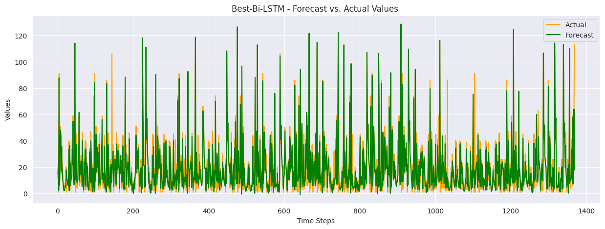
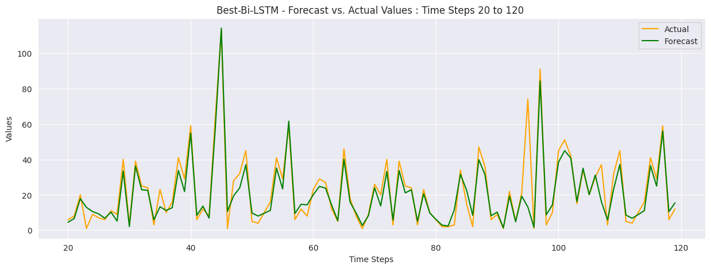

# Time Series with ARIMA, LSTM and GRU

In this project, we explore time series forecasting using both traditional and deep learning models on a disaster dataset. Our goal is to evaluate the performance of various models and identify the best approach for making predictions.

#### 1. Traditional Models: ARIMA, SARIMA, and Auto ARIMA

We started with `ARIMA`, `SARIMA`, and `Auto ARIMA` models, evaluating their performance using metrics such as `ME`, `MSE`, `RMSE`, `MAE`, `MPE`, `MAPE, and `SMAPE` to assess how well they learn from the data and make predictions.

#### 2. Deep Learning Models: LSTM, Bi-LSTM, and GRU

Next, we applied `LSTM, Bi-LSTM`, and GRU models. We evaluated these models using `ME, MSE, RMSE, MAE, MPE, MAPE, SMAPE`, and $R^2$ to measure their forecasting performance.

#### 3. Results and Challenges

Our RNN models, especially `Bi-LSTM`, suffered from overfitting. To address this, we applied data augmentation to improve generalization and reduce overfitting.

#### 4. Final Model Optimization

For the best-performing model (`Bi-LSTM`), we used `Bayesian Optimization` to fine-tune hyperparameters, followed by validation and testing on the final dataset.

